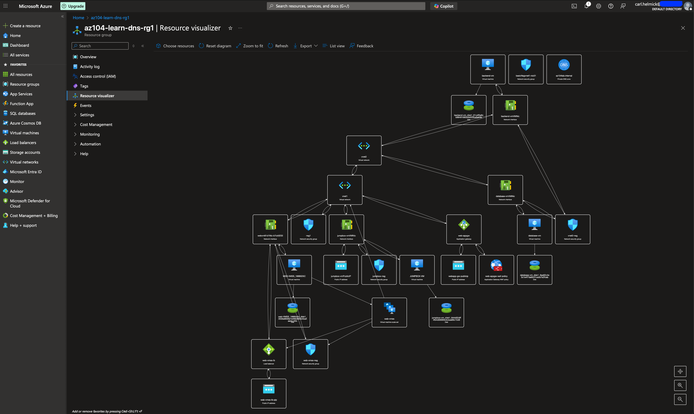

# Azure Multi-VNet Enterprise Architecture

[](https://azure.microsoft.com/)
[](https://docs.microsoft.com/azure/azure-resource-manager/bicep/)
[](LICENSE)
[](https://docs.microsoft.com/learn/certifications/azure-administrator/)

## 🏗️ Overview

A comprehensive **multi-tier Azure infrastructure** demonstrating enterprise-grade networking patterns with **auto-scaling web applications**, **cross-VNet communication**, and **advanced load balancing**. Built for AZ-104 Azure Administrator certification preparation and real-world enterprise deployment scenarios.

### 🎯 Architecture Highlights

- **🌐 Multi-VNet Design**: Cross-network communication with VNet peering
- **⚖️ Dual Load Balancing**: Layer 4 (Azure Load Balancer) + Layer 7 (Application Gateway)  
- **🔒 Enterprise Security**: WAF, NSGs, jump box pattern, private DNS
- **📈 Auto-scaling**: CPU-based VMSS scaling (1-10 instances)
- **🏷️ Service Discovery**: Private DNS zone with comprehensive records
- **🛡️ Zero-Trust Network**: Segmented subnets with security group controls



## 📋 Quick Start

### Prerequisites
- Azure CLI (2.50+)
- Bicep CLI 
- SSH key pair
- Azure subscription with Contributor access

### ⚡ One-Command Deployment

```bash
# Clone repository
git clone https://github.com/yourusername/azure-multivnet-architecture.git
cd azure-multivnet-architecture

# Update parameters (add your SSH key and IP)
vi deployment/main.bicepparam

# Deploy infrastructure
./deploy.sh
```

### 🧪 Validate Deployment

```bash
# Test web applications
curl http://<application-gateway-ip>
curl http://<load-balancer-ip>

# Test cross-VNet connectivity
ssh azuser@jumpbox.az104lab.internal
ssh azuser@backend-vm.az104lab.internal
```

## 🏛️ Architecture Components

| Component | Purpose | Configuration |
|-----------|---------|---------------|
| **VNet1** | Frontend/Web Tier | `10.0.0.0/16` with 3 subnets |
| **VNet2** | Backend/Database Tier | `10.1.0.0/16` with 2 subnets |
| **VMSS** | Auto-scaling Web Servers | Ubuntu 22.04, Nginx, 1-10 instances |
| **Application Gateway** | Layer 7 Load Balancer + WAF | WAF_v2 with OWASP 3.2 rules |
| **Azure Load Balancer** | Layer 4 Load Balancer | Standard SKU with health probes |
| **Jump Box** | Secure Management Access | Ubuntu 22.04 with Azure CLI |
| **Private DNS** | Service Discovery | `az104lab.internal` domain |
| **VNet Peering** | Cross-VNet Communication | Bidirectional with traffic forwarding |

## 📊 Network Topology

```
Internet
    ↓
┌─── Application Gateway (Layer 7 + WAF) ←─── 130.107.46.126
│                    ↓
│    ┌─────────────────────────────────────────────────────┐
│    │                 VNet1 (10.0.0.0/16)                │
│    │  ┌─────────────┐  ┌──────────────┐  ┌─────────────┐ │
│    │  │   Subnet1   │  │   Subnet2    │  │ AppGW Subnet│ │
│    │  │   (VMSS)    │  │ (Jump Box)   │  │             │ │
│    │  │ 10.0.1.0/24 │  │ 10.0.2.0/24  │  │ 10.0.3.0/24 │ │
│    │  └─────────────┘  └──────────────┘  └─────────────┘ │
│    └─────────────────────────────────────────────────────┘
│                    ↕ VNet Peering
│    ┌─────────────────────────────────────────────────────┐
│    │                 VNet2 (10.1.0.0/16)                │
│    │    ┌────────────────┐     ┌─────────────────────┐   │
│    │    │ Backend Subnet │     │ Database Subnet     │   │
│    │    │  (API Services)│     │ (MySQL Database)    │   │
│    │    │  10.1.1.0/24   │     │   10.1.2.0/24       │   │
│    │    └────────────────┘     └─────────────────────┘   │
│    └─────────────────────────────────────────────────────┘
│
└─── Azure Load Balancer (Layer 4) ←─── 4.206.179.100
```

## 🛠️ Repository Structure

```
azure-multivnet-architecture/
├── 📁 deployment/
│   ├── main.bicep                 # Complete infrastructure template
│   ├── main.bicepparam            # Parameters file
│   └── deploy.sh                  # Automated deployment script
├── 📁 scripts/
│   ├── 01_create_jumpbox.sh       # Jump box setup
│   ├── 02_create_vmss.sh          # VMSS web servers
│   ├── 03_create_appgw.sh         # Application Gateway + WAF
│   ├── 04_create_private_dns.sh   # Private DNS zone
│   └── 05_create_vnet2_peering.sh # VNet2 + Peering
├── 📁 docs/
│   ├── architecture-guide.md      # Detailed technical documentation
│   ├── deployment-guide.md        # Step-by-step deployment
│   ├── troubleshooting.md         # Common issues and solutions
│   └── 📁 images/                 # Architecture diagrams
├── 📁 tests/
│   ├── connectivity-test.sh       # Network connectivity validation
│   ├── dns-test.sh                # DNS resolution testing
│   └── performance-test.sh        # Load testing scripts
├── 📄 README.md                   # This file
├── 📄 LICENSE                     # MIT License
└── 📄 .gitignore                  # Git ignore file
```

## 🚀 Features Demonstrated

### 🌐 Advanced Networking
- [x] **VNet Peering**: Bidirectional communication between VNets
- [x] **Network Security Groups**: Granular traffic control
- [x] **Private DNS Zones**: Internal service discovery
- [x] **Service Endpoints**: Secure access to Azure services

### ⚖️ Load Balancing & High Availability  
- [x] **Dual Load Balancing**: Layer 4 + Layer 7 traffic distribution
- [x] **Health Probes**: Automated health monitoring
- [x] **Auto-scaling**: CPU-based scaling policies
- [x] **Availability Zones**: Multi-zone deployment support

### 🔒 Security & Compliance
- [x] **Web Application Firewall**: OWASP Top 10 protection
- [x] **Network Segmentation**: Multi-tier security model
- [x] **SSH Key Management**: Secure authentication
- [x] **Jump Box Pattern**: Controlled administrative access

### 📈 Monitoring & Operations
- [x] **Azure Monitor Integration**: Metrics and alerting
- [x] **Auto-scaling Events**: Detailed scaling activity logs  
- [x] **Health Monitoring**: Application and infrastructure health
- [x] **Cost Optimization**: Resource tagging and monitoring

## 🧪 Testing & Validation

### Automated Testing Suite
```bash
# Run all tests
./tests/run-all-tests.sh

# Individual test categories
./tests/connectivity-test.sh    # Network connectivity
./tests/dns-test.sh            # DNS resolution
./tests/performance-test.sh    # Load testing
```

### Manual Testing Scenarios
- **Cross-VNet Communication**: SSH between VNet1 and VNet2
- **DNS Resolution**: Service discovery via private DNS
- **Auto-scaling**: CPU load generation and scaling observation
- **Security**: NSG rule validation and traffic filtering
- **High Availability**: Instance failure and recovery testing

## 📚 Learning Objectives (AZ-104 Aligned)

This project demonstrates proficiency in key AZ-104 Azure Administrator domains:

### Configure and manage virtual networking (25-30%)
- ✅ Virtual networks and subnets
- ✅ Network security groups and application security groups
- ✅ VNet peering and service endpoints
- ✅ Azure Load Balancer and Application Gateway
- ✅ Private DNS zones and name resolution

### Deploy and manage Azure compute resources (25-30%)
- ✅ Virtual machines and availability sets
- ✅ Virtual machine scale sets
- ✅ Azure Resource Manager templates (Bicep)

### Configure and manage storage (10-15%)
- ✅ Network access to storage accounts
- ✅ Storage service endpoints

### Monitor and maintain Azure resources (10-15%)
- ✅ Azure Monitor and Log Analytics
- ✅ Network monitoring and diagnostics

## 💰 Cost Analysis

| Resource Type | Estimated Monthly Cost (CAD Central) |
|---------------|-------------------------------------|
| VMSS Instances (1-10) | $30 - $300 |
| Application Gateway WAF_v2 | ~$150 |
| Standard Load Balancer | ~$25 |
| Jump Box + Backend VMs | ~$90 |
| Public IP Addresses (3x) | ~$15 |
| VNet Peering + Private DNS | ~$10 |
| **Total Estimated** | **$320 - $590/month** |

> 💡 **Cost Optimization**: Use auto-shutdown policies, spot instances for dev/test, and reserved instances for production workloads.

## 🛠️ Customization & Extensions

### Adding New Services
```bicep
// Add microservice to VNet2
resource microserviceVm 'Microsoft.Compute/virtualMachines@2023-09-01' = {
  name: 'microservice-vm'
  // ... configuration
}

// Add DNS record
resource microserviceDns 'Microsoft.Network/privateDnsZones/A@2020-06-01' = {
  parent: privateDnsZone
  name: 'microservice'
  // ... DNS configuration
}
```

### Scaling to Additional Regions
- Deploy template in multiple Azure regions
- Configure global load balancing with Traffic Manager
- Implement cross-region VNet peering
- Set up geo-redundant DNS resolution

## 🤝 Contributing

Contributions are welcome! Please see [CONTRIBUTING.md](CONTRIBUTING.md) for guidelines.

### Areas for Enhancement
- [ ] Azure Bastion integration
- [ ] Key Vault for secrets management
- [ ] Container instances deployment
- [ ] Azure Monitor dashboards
- [ ] Terraform alternative templates
- [ ] PowerShell deployment scripts

## 📄 License

This project is licensed under the MIT License - see the [LICENSE](LICENSE) file for details.

## 🎯 Certification Path

This repository demonstrates practical skills for:
- **AZ-104: Microsoft Azure Administrator**
- **AZ-303/304: Microsoft Azure Architect Technologies/Design**
- **AZ-500: Microsoft Azure Security Technologies**

---

### 🌟 Star this repository if it helped you learn Azure networking concepts!

**Built with ❤️ for the Azure community and AZ-104 certification journey**